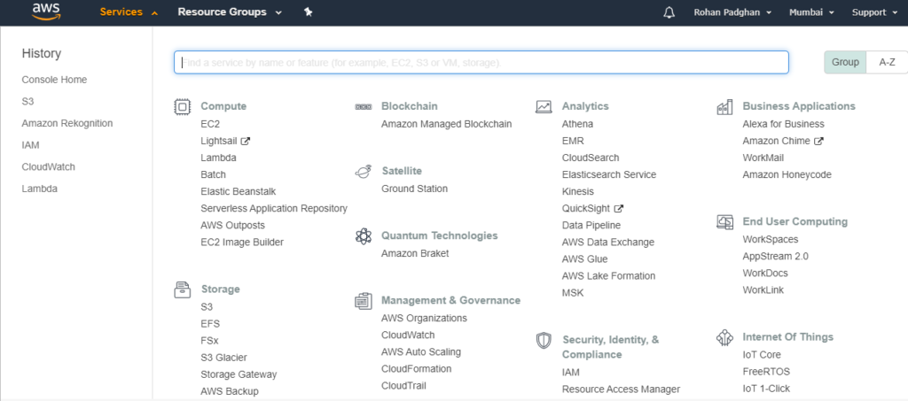
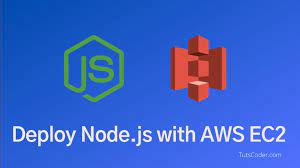
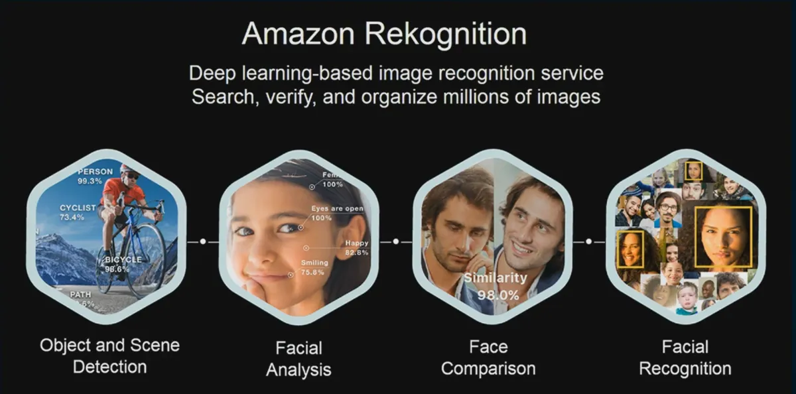

# AWS and DevOps Tasks

## Description

I completed the following tasks to create small apps and build foundational knowledge of AWS and DevOps using both; AWS Console and AWS CLI.


## Technologies Used


- Amazon POLLY
- Amazon Rekognition
- EC2
- S3
- IAM
- CloudWatch

## Task One



OBJECTIVE:

- Build AWS console knowledge and learn how to access resources, especially EC2 by deploying a Node.js / Express.js server on AWS EC2

```node
const express = require("express");
const app = express();
const port = 3000;

app.get("/", (req, res) => {
  res.send("Hello Daniel!");
});

app.listen(port, () => {
  console.log(`Example app listening on port ${port}`);
});
```

In order to complete the task I implemented the following;

- Used a `t2.micro` instance (the default).
- Used Amazon Linux operating system.
- Allow HTTP and SSH traffic.
- Enabled public IP address creation.
- Used `npm` to install the dependencies.
- Redirected requests from Port 80 to Port 3000 to allow the server to respond.

## Task Two

OBJECTIVE:

- The purpose of the following tasks was to gain familiarity with accessing AWS resources using the API provided for the command line.

### Amazon POLLY

[Amazon Polly](https://aws.amazon.com/polly/) (text-to-speech software).


This task involved using Amazon Polly, a text-to-speech software, to generate audio files from text in different languages.
The task required creating an S3 bucket to store text files, writing a small text file in English and another in a different language, and saving them to the S3 bucket.
It also involved creating a bucket to store audio files and using Amazon Polly to create a sound file from the text, choosing a voice and pronunciation for the rendered speech. The resulting sound files are saved to S3.
.Finally I implemented the functionality of Amazon Polly reading the sound file directly from S3. Additionall, I set up and used a bucket policy to manage access to the sound file bucket, enabling other users to download and listen to the sound files.


### Amazon Rekognition

[Amazon Rekognition](https://aws.amazon.com/rekognition/)


This task involved using Amazon Rekognition, a machine learning tool for image and video analysis, to analyze some image files and test its abilities to detect people, faces, emotions, activities, and celebrities. I made use of the AWS CLI to pass image files into Rekognition and obtain JSON output that describes the contents of the pictures.

I used jq, a command-line JSON processor, to extract certain attributes from the JSON output obtained from Rekognition and saved the to a local .txt file.



## Authors

- GitHub: [Daniel Clough](https://github.com/daniellee862)
- LinkedIn: [Daniel Clough](https://www.linkedin.com/in/danielclough86/)

## License

[MIT](https://choosealicense.com/licenses/mit/)
